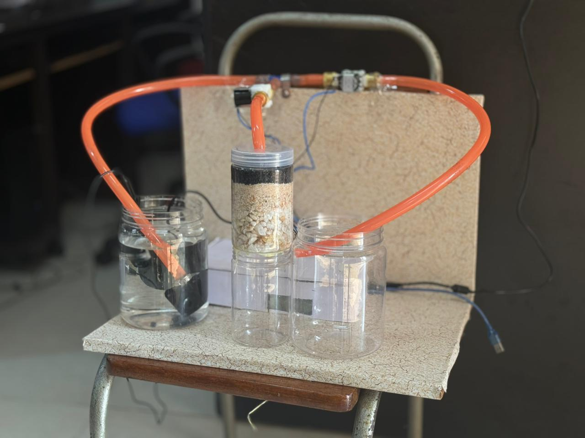
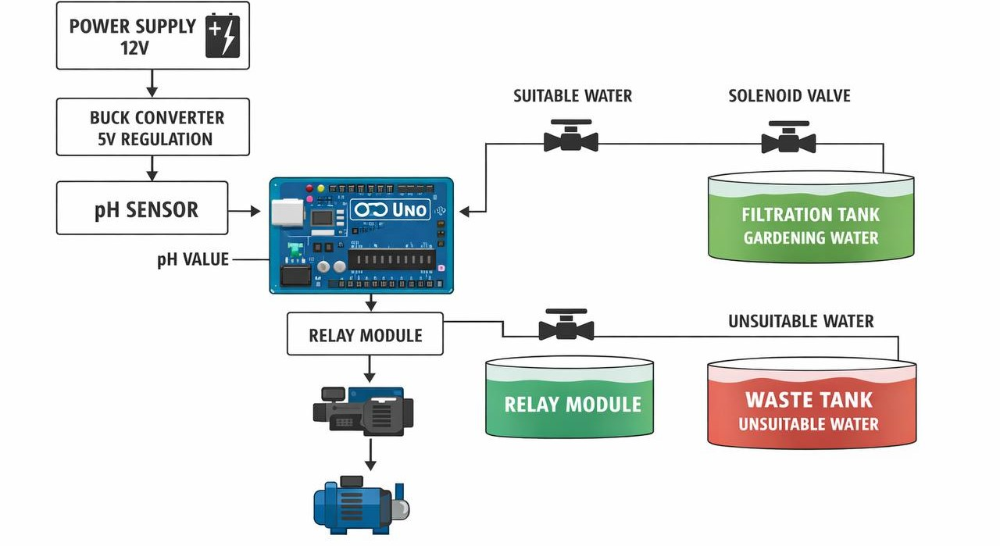
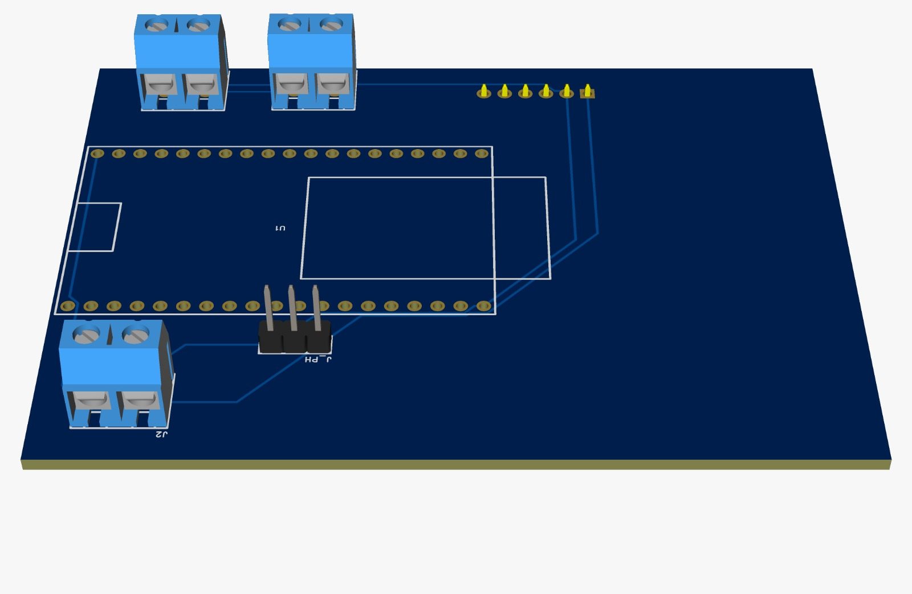
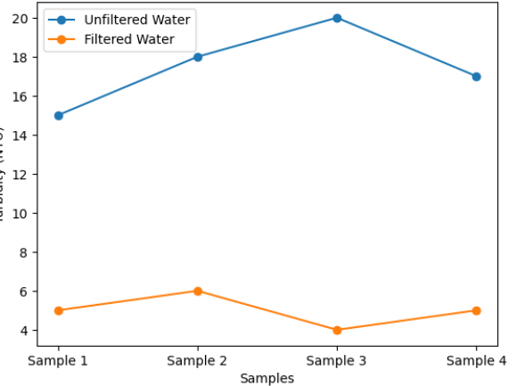

# Greywater Quality Detector for Sustainable Household Water Reuse

This project presents an automated system for monitoring and reusing greywater using a pH sensor and Arduino-based control system. The system continuously analyzes the pH level of greywater and determines whether it is suitable for reuse or should be discarded.

Based on predefined threshold values, the system automatically controls solenoid valves and a water pump using a relay module. If the water quality is acceptable, it is directed to a filtration unit consisting of silex sand and activated carbon. Otherwise, the water is diverted to a waste outlet.

## Features
- Real-time pH monitoring
- Automated water diversion
- Filtration system
- Low-cost and efficient design

## Components
- Arduino UNO
- pH Sensor
- Relay Module
- Solenoid Valves
- Water Pump

## Hardware Setup

## Block Diagram

## PCB Design

## Results

> Smart greywater reuse using real-time pH monitoring and automated control.
